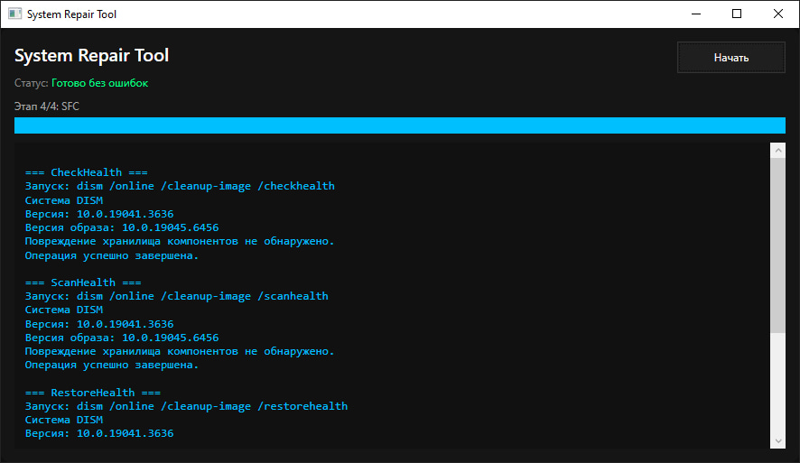

# System Repair Tool (DISM & SFC)

## RU

Утилита для диагностики и восстановления системы Windows с использованием встроенных инструментов DISM и SFC.

### Описание

Программа последовательно выполняет:

* DISM /CheckHealth
* DISM /ScanHealth
* DISM /RestoreHealth
* SFC /scannow

Отображает текущий этап, общий прогресс выполнения и вывод команд в реальном времени.

### Возможности

* Графический интерфейс (WPF)
* Автоматический запуск с правами администратора
* Живой вывод команд без буферизации
* Общий прогресс (0–100%)
* Этапы выполнения (1/4)
* Фильтрация служебного вывода DISM
* Корректная обработка кодировок (DISM / SFC)
* Определение возможных ошибок
* Итоговое сводное сообщение

### Использование

1. Скачать `.exe` из раздела Releases
2. Запустить
3. Подтвердить запуск от администратора
4. Дождаться завершения

---

## ENG

A utility for diagnosing and repairing Windows system files using built-in DISM and SFC tools.

### Overview

The application runs the following commands in sequence:

* DISM /CheckHealth
* DISM /ScanHealth
* DISM /RestoreHealth
* SFC /scannow

It displays the current step, overall progress, and real-time command output.

### Features

* Graphical interface (WPF)
* Automatic administrator elevation
* Real-time output (no buffering)
* Overall progress (0–100%)
* Step tracking (1/4)
* DISM output filtering
* Proper encoding handling (DISM / SFC)
* Basic error detection
* Summary after completion

### Usage

1. Download the `.exe` from Releases
2. Run the application
3. Accept the UAC prompt
4. Wait until completion

---

## Screenshot

---

## Requirements

* Windows 10 / 11
* .NET 6 / 7 / 8

---

## Notes

* The process may take a long time
* Internet connection is required for RestoreHealth
* Do not interrupt execution
* Reboot is recommended after completion

---

## License

MIT License

---

## Author

Rikolai
https://github.com/RikolaiYT
